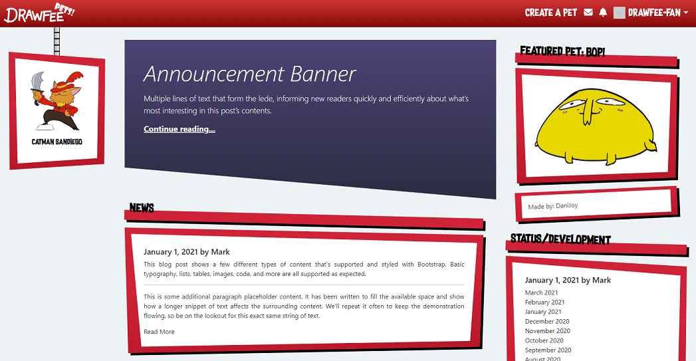

# drawfee-pets


## Table of contents
* [General info](#general-info)
* [Technologies](#technologies)
* [Setup](#setup)

## General info
Drawfee is a comedy drawing YouTube show where artists (primarily Nathan Yaffe, Jacob Andrews, Julia Lepetit, and Karina Farek) turn audience suggestions into silly drawings.

Drawfee Pets is a lovingly made fan-project to give a home to these wayward drawings.

Functionally, this is a virtual pet website. I use this project as a playground for testing or implementing new things I've learned. It is built using the MERN stack.

You can view it at [https://drawfee-pets.herokuapp.com/](https://drawfee-pets.herokuapp.com/)
	
## Technologies
Project is created with:
* React
* Bootstrap v5
* Framer Motion
* GraphQL
* Apollo
* Express
* Mongoose
	
## Setup
To run this project, install it locally using npm:

```
$ npm i
$ npm develop
```